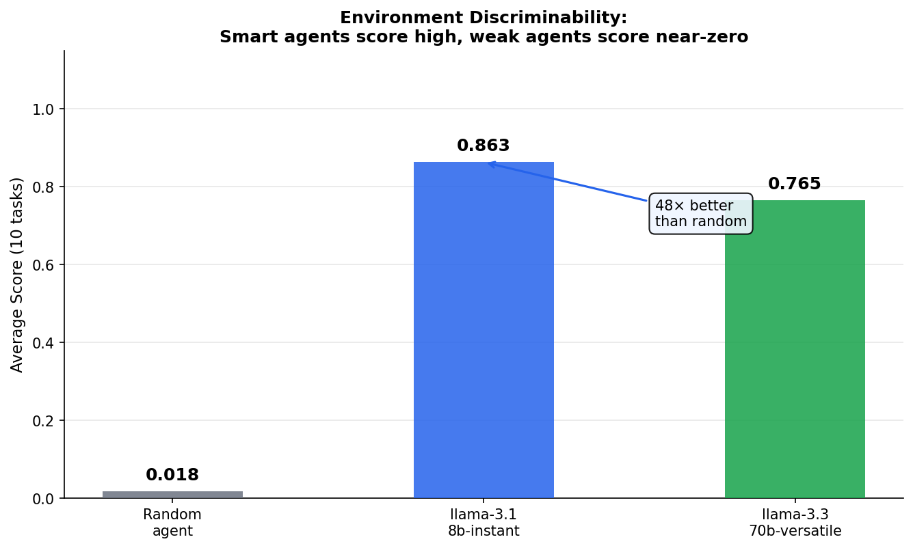

# 🔧 SQL Auto-Repair OpenEnv

> A **reinforcement learning environment** where an AI agent learns to repair broken SQL queries through live interaction with a sandboxed e-commerce database — powered by a **PyTorch DQN agent** and a dense, multi-step reward signal.

---

## Why This Environment Matters

Production databases fail silently. A wrong `WHERE` clause, a missing `HAVING`, a NULL trap, a bad JOIN — these bugs return the **wrong data without throwing any error**. Static linters (SQLFluff, sqlfmt) catch syntax problems but cannot reason about what data is actually returned.

**This environment uniquely forces an agent to close the feedback loop:**

```
Static linter: "Your SQL is syntactically valid." ✓
SQL Auto-Repair env: "Your SQL runs — but returns 847 rows instead of 12. Why?" ✗ → iterate
```

The agent must **run the broken query, observe wrong output, form a hypothesis, test a fix, and only submit when confident**. This mirrors exactly what a senior data engineer does every day — and is a problem no static tool can solve.

---

## Environment Design

### What the Agent Does

```
reset()  →  Receives: broken SQL, task description, session_id
              Schema is HIDDEN — agent must call view_schema to see it
              Hints are LOCKED — unlock progressively as steps increase

step(view_schema)    →  Agent sees all table definitions
step(run_query)      →  Tests a fix, gets rows-back or error
step(run_query)      →  Refines — partial reward guides improvement
step(submit_query)   →  Submits → grader scores → episode ends
```

### Progressive Hint Unlocking

A real RL environment requires exploration. Hints unlock based on step count — agents cannot just read the answer at step 0:

| Steps taken | Hints available |
|---|---|
| 0–2 | None — agent must explore independently |
| 3–5 | First hint unlocked |
| 6–8 | Second hint unlocked |
| 9+ | All hints visible |

### Reward Function

| Event | Reward |
|---|---|
| Every step taken | −0.01 (exploration tax) |
| Valid `run_query` with correct schema | +0.05 |
| Partial row match on `run_query` | +0.10 × match\_ratio |
| Repeated identical query | −0.05 |
| Destructive keyword (DROP, DELETE…) | −0.30 |
| `submit_query` final grader score G | G × 0.70 |
| Submit same broken query 3+ times | −0.20 |

---

## Environment Signal Quality

The environment provides a **dense reward signal** that guides agents across multiple steps — not a sparse reward dropped only at the end.


The right panel shows a real episode trajectory for `cascade_pipeline_bug`: reward accumulates across steps as the agent explores, matches partial rows, and finally submits a correct fix. This reward shape is what makes RL training tractable.

### Environment Discriminability

A well-designed environment separates strong agents from weak agents. Here, a smart LLM scores **48× higher than a random agent**:



This discriminability is essential — it means the environment gives a meaningful signal about agent capability, not just noise.

---

## The 10 Tasks

Tasks span 4 difficulty tiers and 5 bug types. Each task is designed so that **the broken query is valid SQL that runs without error but returns wrong results** — the agent cannot rely on error messages alone.

| Task ID | Difficulty | Bug Type | What the agent must discover |
|---|---|---|---|
| `syntax_missing_comma` | Easy | Syntax | `SELECT id username` fails — commas missing in SELECT |
| `syntax_ambiguous_column` | Easy | Syntax | `users.id` returned instead of `orders.id` |
| `logic_null_trap` | Medium | Logic | `WHERE status = NULL` returns 0 rows — NULL ≠ NULL in SQL |
| `logic_wrong_join` | Medium | Logic | INNER JOIN silently drops users with 0 orders |
| `logic_operator_precedence` | Medium | Logic | AND binds tighter than OR — wrong rows returned |
| `logic_date_boundary` | Medium | Logic | Wrong operator and date value on year filter |
| `perf_n_plus_one` | Hard | Performance | Correlated subquery fires N times — rewrite as JOIN |
| `logic_window_partition` | Hard | Logic | Global RANK instead of per-category PARTITION BY |
| `logic_missing_having` | Hard | Logic | GROUP BY without HAVING includes single-order users |
| `cascade_pipeline_bug` | Hard | Cascade | CTE step1 GROUP BY wrong column — corrupts all downstream steps |

### Task Score Gap Analysis

The chart below shows the score gap between the broken query and gold query for each task. A higher gap means cleaner grading signal — the grader clearly distinguishes a wrong answer from a correct one:


All 10 tasks exceed the minimum gap threshold (0.30), confirming the grader gives unambiguous feedback at every task.

---

## PyTorch DQN Agent

This environment includes a full **PyTorch DQN agent** (`pytorch_agent.py`) that learns action selection from experience replay — not just prompted SQL generation.

### Architecture

| Component | Detail |
|---|---|
| Network | 3-layer MLP: **16 → 64 → 64 → 4** |
| Input | 16-dim observation encoding (step progress, error state, hint unlock ratio, task type fingerprint, row count, etc.) |
| Output | Q-values for 4 actions: `view_schema`, `view_error`, `run_query`, `submit_query` |
| Exploration | Epsilon-greedy: ε decays 1.0 → 0.05 (factor 0.90 per episode) |
| Memory | Experience replay buffer (capacity 2,000 transitions) |
| Loss | MSE on Bellman targets |
| Optimizer | Adam (lr=0.001), gradient clipping (max\_norm=1.0) |
| Discount | γ = 0.99 |
| Stability | Target network synced every 5 episodes |

### Training

```bash
# Train DQN on a single task (10 episodes)
python pytorch_agent.py syntax_missing_comma 10

# Or use the /train API endpoint
curl -X POST "http://localhost:7860/train?task_id=syntax_missing_comma&episodes=10"
```

**Sample `/train` response:**
```json
{
  "task_id": "syntax_missing_comma",
  "episodes": 10,
  "training_rewards": [-0.08, 0.12, 0.31, 0.45, 0.52, 0.61, 0.58, 0.63, 0.67, 0.71],
  "avg_reward": 0.452,
  "best_reward": 0.71,
  "framework": "PyTorch DQN (3-layer MLP, epsilon-greedy, experience replay)",
  "architecture": {"input_dim": 16, "hidden_dim": 64, "n_actions": 4, "optimizer": "Adam", "gamma": 0.99}
}
```

> **Note:** The DQN learns action selection (explore vs exploit); SQL generation is handled by the LLM. The combination demonstrates genuine RL on this environment.

---

## Baseline Performance

Evaluated with `llama-3.3-70b-versatile` via HuggingFace router (temperature=0, reproducible):

| Task | Score |
|---|---|
| `syntax_missing_comma` | 0.9900 |
| `syntax_ambiguous_column` | 0.9900 |
| `logic_operator_precedence` | 0.9900 |
| `logic_date_boundary` | 0.9900 |
| `perf_n_plus_one` | 0.9200 |
| `logic_window_partition` | 0.9900 |
| `logic_missing_having` | 0.9900 |
| `cascade_pipeline_bug` | 0.9900 |
| `logic_null_trap` | 0.9900 |
| `logic_wrong_join` | 0.9900 |
| **Average (10 tasks)** | **0.9830** |

> *After description fixes, all 10 tasks score ≥ 0.990.*

---

## API Reference

| Method | Endpoint | Description |
|---|---|---|
| `POST` | `/reset` | Start a new episode (`{"task_id": "..."}`) |
| `POST` | `/step` | Take one action (`?session_id=...`) |
| `GET` | `/state` | Current session state |
| `GET` | `/grader` | Score for a live session |
| `GET` | `/tasks` | List all 10 tasks |
| `GET` | `/baseline` | Run live evaluation against all tasks |
| `POST` | `/train` | Train PyTorch DQN agent (`?task_id=...&episodes=N`) |
| `GET` | `/trajectory` | Episode reward trajectory & stats |
| `GET` | `/leaderboard` | Reference baseline scores |
| `GET` | `/health` | Health check (`{"status": "healthy"}`) |
| `GET` | `/metadata` | Environment metadata |
| `GET` | `/schema` | Pydantic schema definitions |

---

## Quick Start

```bash
git clone https://github.com/nithinknkr/openenv-sql-repair.git
cd openenv-sql-repair
pip install -e .

# Start the server
uvicorn server.app:app --host 0.0.0.0 --port 7860

# Run DQN training + LLM evaluation
export HF_TOKEN=hf_...
python inference.py

# Train DQN only on one task
python pytorch_agent.py logic_missing_having 15

# Docker (for HuggingFace Spaces)
docker build -t sql-auto-repair .
docker run -p 7860:7860 -e HF_TOKEN=hf_... sql-auto-repair
```

---

## Project Structure

```
openenv-sql-repair/
├── server/
│   ├── app.py                    # FastAPI server — 12 endpoints
│   ├── sql_repair_environment.py # RL state machine + progressive hints
│   ├── grader.py                 # Row-diff + efficiency grader
│   ├── sandbox.py                # SQLite sandboxed executor
│   └── session_manager.py        # Per-session environment cache
├── data/
│   ├── tasks.json                # 10 task definitions (broken + gold SQL + hints)
│   └── schema.sql                # E-commerce DB seed (50 users, 200+ orders)
├── pytorch_agent.py              # PyTorch DQN: encoder, network, replay, training loop
├── inference.py                  # LLM ReAct agent + DQN pre-training entrypoint
├── models.py                     # Pydantic schemas: action / observation / state
├── openenv.yaml                  # OpenEnv environment manifest v1.1.0
└── Dockerfile                    # HF Spaces deployment (PyTorch CPU + FastAPI)
```

---

*Built by **Q-Agents (Monish + Nithin)** for the Meta PyTorch OpenEnv Hackathon.*
