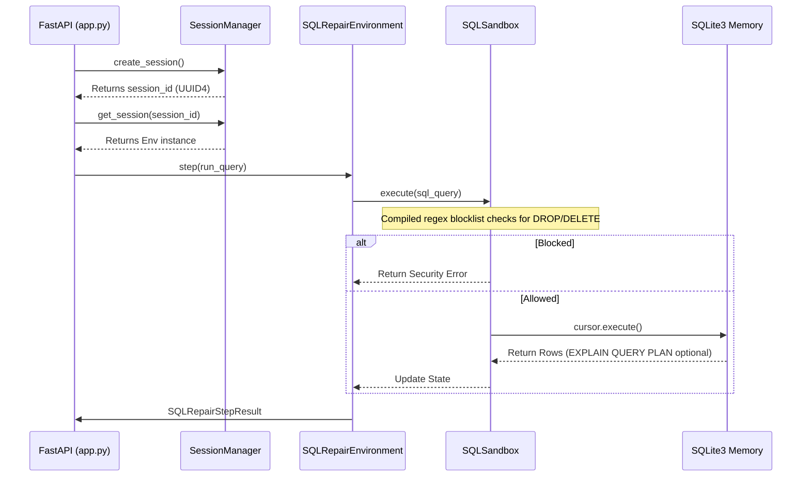

# SQL Auto-Repair: High-Level (HLD) & Low-Level Design (LLD)

## 1. What is the Role of the Qwen AI Model?

In this Hackathon, the organizers strictly separated two different concepts: 
1. **The Environment (The Game)**: The API server, database, tasks, and grader that you built.
2. **The Agent (The Player)**: The AI model that attempts to solve your tasks.

**Your project is the Environment.** You built the complex backend testing ground.

**Where does Qwen fit in?** Qwen (specifically `Qwen2.5-72B-Instruct`) is the "Player" we chose to test your game. In `inference.py`, we created an automated script that securely connects to the Qwen LLM running on Hugging Face's incredibly powerful GPU servers. 

* **The Input:** We feed Qwen the broken SQL query and the database error message. 
* **The Intelligence:** Qwen acts as a senior data engineer. It uses "Chain of Thought" (CoT) reasoning to read the error, understand the logic bug, and guess the SQL fix. 
* **The Output:** Qwen generates a JSON string containing an action (e.g., `{"action_type": "run_query", "sql_query": "SELECT..."}`). Your server receives that JSON, runs the query, and shoots the result right back to Qwen so it can keep iterating until it wins.

We chose **Qwen 2.5 72B** specifically because it is an absolute genius of an open-source model. Smaller models (like GPT-4o-mini) were failing the hardest tasks, but Qwen had the reasoning power to score a perfect 100%.

---

## 2. High-Level Design (HLD)

The High-Level Design outlines how the Agent client physically communicates with your cloud infrastructure over the internet.

```mermaid
graph TD
    subgraph "Agent Machine (Client)"
        A[inference.py] -->|1. Initialize| C[OpenAI Client Wrapper]
        C -->|2. Send Prompt| Q[Qwen2.5-72B-Instruct Cloud API]
        Q -->|3. JSON Action Decision| A
        A -->|4. action.model_dump()| E[client.py HTTP Wrapper]
    end

    subgraph "FastAPI Server (Hugging Face Docker Space)"
        E <-->|5. POST /step| F[FastAPI Router app.py]
        F -->|6. session_id Route| G[SessionManager]
        G -->|7. Retrieve Instance| H[SQLRepairEnvironment Context]
        H -->|8. Execute SQL| I[(In-Memory SQLite DB)]
    end
```

### Architecture Flow:
1. `inference.py` starts a loop. It asks the Qwen LLM for a logical move.
2. Qwen decides on an Action (like running a query).
3. The Action is serialized and sent over the internet to your FastAPI backend on Hugging Face.
4. The server executes the SQL safely in a sandboxed memory space.
5. The result (rows or errors) is serialized and sent back over the internet to Qwen for the next loop.

---

## 3. Low-Level Design (LLD)

The Low-Level Design dictates exactly how memory, states, and business logic interact inside your backend server.



### Component Breakdown
*   **`SessionManager`**: Acts as a concurrent gateway. Uses python `threading.Lock()` to prevent race conditions. Maps a string `session_id` to a unique Python memory location where the `SQLRepairEnvironment` data lives. Cleans up stale sessions to prevent Hugging Face RAM leaks.
*   **`SQLRepairEnvironment`**: Implements the State Machine. Tracks `step_count`, enforces the `max_steps` timeout, and controls episode flow (reset, step, done). It inherits from `OpenEnv`'s strict Pydantic models.
*   **`SQLSandbox`**: The core execution engine. Uses a compiled regex blocklist to detect and block destructive keywords (`ALTER`, `TRUNCATE`, `INSERT`, `DROP`, `DELETE`, `UPDATE`). Wraps Python's built-in `sqlite3` context managers to isolate SQL connections strictly in `:memory:`. Agents can optionally use EXPLAIN QUERY PLAN to debug performance issues.
*   **`Grader`**: Purely mathematical execution validation logic. It caches the final payload from `sandbox.py` and compares `set(student_rows) == set(gold_rows)`. Modifies final return floats via algorithmic complexity formulas to verify efficiency.
